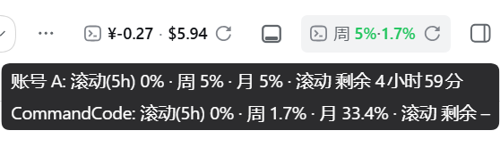

# dsh-account-balance

> DeepSeek + OpenRouter 双账户余额芯片 · Dual account balance chip for DeepSeek Harness Web

会话头部常驻的 **双账户余额芯片**：同时显示 DeepSeek 与 OpenRouter 的可用余额，3 分钟自动刷新，悬停查看两家明细。

A persistent **dual-account balance chip** in the conversation header: shows both DeepSeek and OpenRouter balances, auto-refreshes every 3 minutes, with per-account breakdowns on hover.



▲ 会话头部实况：`¥ · $` 两段数字即本插件余额芯片（DeepSeek ¥ + OpenRouter $），悬停弹出双账户明细气泡；右侧「周 5%·-1.7%」用量芯片来自 [dsh-opencode-go](../dsh-opencode-go)。

## 兼容性 / Compatibility

| Harness 核心 | 状态 |
|---|---|
| 0.1.2-rc.1 | ✅ 发布基线（2026-09-05） |
| 0.1.5-rc.2 | ✅ 实测通过（2026-09-26）：两条余额路由 + 芯片挂载 / 自动刷新 / 悬停明细均正常 |
| 0.1.7-rc.2（npm `next` 通道最新） | ✅ 核查通过（2026-09-26，v0.2.2，静态比对发布产物）：宿主 `credentialRef` / `launchEnvironmentOf` / `webServer.register({kind,path,handler})` 契约不变；前端 seed 内置 `ui-primitives` / `ui-slots` / `react`；`conversation.session.header.utilities` 槽位保留 |

> 客户端模块供给机制在 0.1.5 → 0.1.7 间有变化：0.1.5 由应用把 bundle 内置包投影到 profile 的 `.dsh-module-fallback/` 目录供给；0.1.7 起磁盘投影被移除，`ui-primitives` / `ui-slots` 改为前端 bundle 内置（platform seed），而 **`dsh-client-runtime` 平台侧整体退场**。本插件 v0.2.2 起不再 inject / 依赖 `dsh-client-runtime`（代码本就未 require 它，0.1.5 与 0.1.7 加载器下行为一致）。其余依赖版本**不要**自行上调，原因见仓库根 [PITFALLS.md](../../PITFALLS.md) 与根 README「客户端依赖对齐」一节。

## 功能 / Features

- 一枚芯片同时显示两家余额：`¥xx.xx · $xx.xx`（OpenRouter 可用余额 = 充值 − 已用）
- 悬停气泡分两段明细：
  - DeepSeek：总余额 · 充值 · 赠送
  - OpenRouter：可用 · 充值 · 已用
- **一家失败不影响另一家**：任一来源出错只在芯片上显示该来源的错误标记
- **3 分钟自动刷新** + 手动刷新按钮（两家同时刷）
- **切换会话不重复拉取**：余额数据与定时器为模块级共享缓存
- 密钥只存在于宿主侧，浏览器永不接触

## 安装 / Install

```bash
dsh plugin --profile web add github:305037991x-pixel/dsh-plugins#path:packages/dsh-account-balance
```

重启 `dsh web` 并硬刷新页面（Ctrl+Shift+R）。

> 本机开发可用 `install-into-dsh.ps1`（包内自带）以 `link:` 方式注册本地源码目录，改源码后重启即生效。

## 配置 / Configuration

在 `$DSH_HOME/.credentials.yaml` 中配置（或环境变量同名，缺哪个来源就只显示另一个）：

```yaml
DEEPSEEK_API_KEY: sk-xxx
OPENROUTER1_API_KEY: sk-or-v1-xxx
```

## 工作原理 / How it works

| 端 | 文件 | 职责 |
|---|---|---|
| Host | `lib/index.js` | 注册 `GET /dsh-account-balance`（DeepSeek）与 `GET /dsh-account-balance/openrouter`（OpenRouter）：各自从凭证服务（环境变量 → `$DSH_HOME/.credentials.yaml` → `.env`）解析密钥后调上游接口，响应原样透传 |
| Client | `lib/client.js` | 在 `conversation.session.header.utilities` 槽位注册芯片；模块级共享两家数据 + 3 分钟定时器 |

余额数据来源：
- [DeepSeek API - Get User Balance](https://api-docs.deepseek.com/api/get-user-balance/)
- [OpenRouter API - Get Credits](https://openrouter.ai/docs/api-reference/limits)（`total_credits` − `total_usage` = 可用）

## License

MIT
